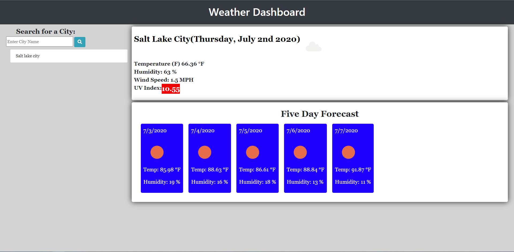
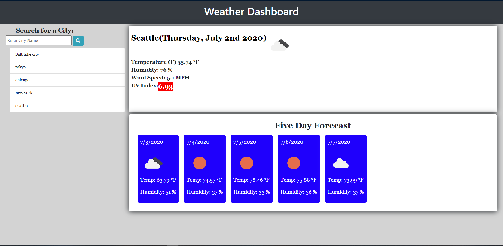

# weather-dashboard

This is my weather-dashboard.

## Link to the website

My live deployment of weather-dashboard is located here: <https://eelektrick.github.io/weather-dashboard/>

## My Journey with Weather-Dashboard

This was a time consuming project and needed more javascript to make everything work.

Made the basic layout of the html rather quick but ended up spending 6-8 hours creating the javascript.

Also took more use with the local storage and how to apply it and block un neccesary objects.

Working with ajax was confusing at first but after this assignment it makes a bit more sense how to work with APIs.

## How to use the Weather-Dashboard

When you first load into the weather dashboard it will show Salt lake city weather first due to it is my location.

To search another cities weather you type in the cities name and click the search button.

This will bring up the current day weather plus show the next 5 days forecast.

If you choose you can click on the list of previously searched cities to see their weather again.